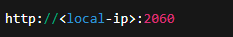
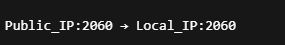
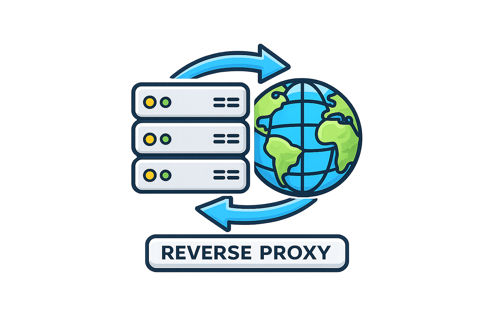
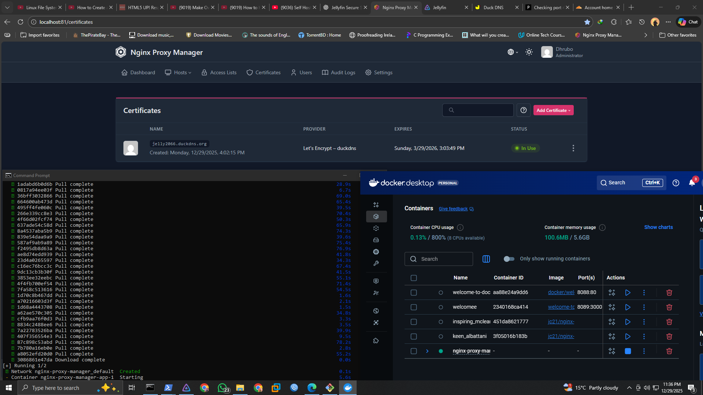

# 📌 Project Motivation:

I wanted to build a personal media server that I could access securely from anywhere, especially on my mobile device.
While my computer is mainly used for work and learning, my phone is my primary device for entertainment. This naturally led me to explore Jellyfin as a self-hosted alternative to cloud streaming services.

While working in a Network Operations Center (NOC) at an ISP, I often found myself asking:

How do real-world services like FTP servers, media servers, and VPNs remain reachable and secure from anywhere on the internet, while most home services stay limited to private networks?

Initially, I built my Jellyfin server only for local use.
However, when I wanted to access it securely from my mobile device outside my home network, I realized this was the perfect opportunity to move beyond theory and truly understand real networking concepts in practice.

This project became a problem-driven learning journey, not just a media server setup.

### 🎯 *Purpose of This Repository:*

This repository documents my hands-on exploration of how services are:

Exposed securely

Protected from common risks

Designed in ways similar to real ISP / NOC environments

Rather than following a single tutorial, this project reflects:

Real questions

Real mistakes

Real fixes

Gradual improvement over time

### 🧠 *What This Project Covers:*

This repository will progressively document my learning and implementation of:

- Self-hosting fundamentals

- Reverse proxies

- SSL/TLS and certificate handling

- DNS & Dynamic DNS

- Secure exposure using tunnels

- Docker-based service deployment

- VPN-based private access

- MikroTik RouterOS networking labs

Each topic is added step by step, following how the problems were discovered and solved in real life.

### 🛠️ *Technologies Used:*

* Jellyfin — Media Server

* DuckDNS — Dynamic DNS

* Cloudflare Tunnel — Secure outbound tunneling

* Caddy — Reverse Proxy (learning phase)

* Nginx Proxy Manager — Reverse Proxy with Docker

* Docker & Docker Desktop (WSL-based)

* WireGuard VPN — Private remote access

* MikroTik RouterOS — PPP, VPN, routing, firewall labs

### 📘 *Learning Philosophy:*

This is not a copy-paste tutorial project.

It is a problem-driven learning log, very similar to how issues are identified, tested, and solved in real NOC and ISP environments.

### 🧩 *Architecture:*

## 📅 Jellyfin LAN Validation & External Access Test:

### 🖥️ *Local Network Setup (LAN):*

Jellyfin was installed and configured within the local network:

Media libraries were added and indexed

Jellyfin was bound to a local IP

Accessed via the default port:

### 🌐 *External Access via Port Forwarding:*

To access Jellyfin from outside the home network, port forwarding was configured:

This made Jellyfin reachable from:

- Mobile data

- Office network

### ⚠️ *Key Security Observations:*

While port forwarding was simple, it introduced serious risks:

Jellyfin was directly exposed to the internet

Traffic was served over unencrypted HTTP

Open ports are easily discoverable by scanners

Increased risk of unauthorized access and brute-force attacks

## 📅 Reverse Proxy & HTTPS (Why SSL Matters):

🔁 What Is a Reverse Proxy?

A reverse proxy is a service that sits in front of an application and acts as an intermediary between users and the backend service.

### 🔐 *Why HTTPS (SSL/TLS) Is Critical:*

Serving Jellyfin over HTTP means:

* Login credentials are sent in plain text

* Traffic can be intercepted

* Sessions can be hijacked

HTTPS solves this by:

* Encrypting all traffic

* Verifying server identity

* Protecting credentials and streams

Modern HTTPS relies on SSL/TLS certificates

### ⚙️ *What I Tried:*

At this stage, I experimented with using a reverse proxy in front of Jellyfin:

* Jellyfin continued running on a private LAN IP

* The reverse proxy handled:

  * Incoming HTTPS traffic

  * SSL certificate issuance

  * Forwarding requests internally to Jellyfin

This immediately improved the security posture:

* Jellyfin was no longer directly exposed

* All external traffic was encrypted

* Access was routed through a single controlled entry point

### 🖥️ *Caddy Reverse Proxy:*

What’s happening here:

* Caddy is installed and managed using NSSM (Non-Sucking Service Manager)
  → This allows Caddy to run persistently as a Windows background service.

* Caddy automatically requests an SSL/TLS certificate from Let’s Encrypt for:

* The logs show:

  * Successful ACME TLS-ALPN challenge

  * Certificate issuance and validation

  * HTTPS being enabled without manual certificate configuration

Jellyfin is now accessible securely via:

* All external traffic is:

  * Encrypted (HTTPS)

  * Terminated at Caddy

  * Safely forwarded to Jellyfin running on a local private IP

# 📅 Docker & Nginx Proxy Manager:

### 🐳 *Why Docker?*

Docker allows applications to run in isolated containers while sharing the host system’s resources.

In simple terms:

Image → blueprint of the application

Container → running instance of that blueprint

Docker does not emulate hardware.
It runs applications directly using the host’s CPU, memory, and storage.

### 🔍 *Why Docker Made Sense Here:*

* Reverse proxy software is typically Linux-based

* My system is Windows

* Docker (with WSL) allows Linux services to run cleanly on Windows without:

  * Dual booting

  * Virtual machines

  * System pollution

Using Docker meant:

* Easy start/stop of services

* Clear separation between applications

* Predictable and repeatable configuration

### 🧱 *Introducing Nginx Proxy Manager:*

Instead of configuring raw Nginx manually, I chose:

→ Nginx Proxy Manager

### ⚙️ *How It Was Deployed:*

* Docker Desktop was installed and running

* Nginx Proxy Manager was deployed using Docker

* Required ports were bound (80 / 443)

* Data was persisted using Docker volumes

## 📅 Cloudflare Tunnel:

Cloudflare Tunnel creates an outbound, encrypted connection from your local machine to Cloudflare’s network.

Instead of:

* Opening ports on your router

* Letting the internet connect into your home

### ⚙️ *What I Tested:*

* Created a Cloudflare Quick Tunnel

* Exposed Jellyfin using a temporary Cloudflare URL

* Verified access from:

  * Mobile data

  * External networks

### ⚠️ *Limitations Discovered:*

→🔗 Temporary URLs

* Quick Tunnels generate temporary domains

* Not suitable for long-term use

